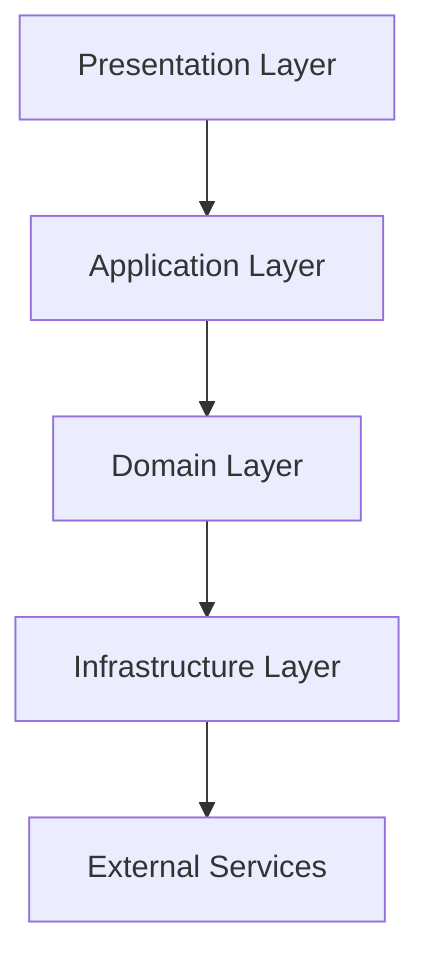
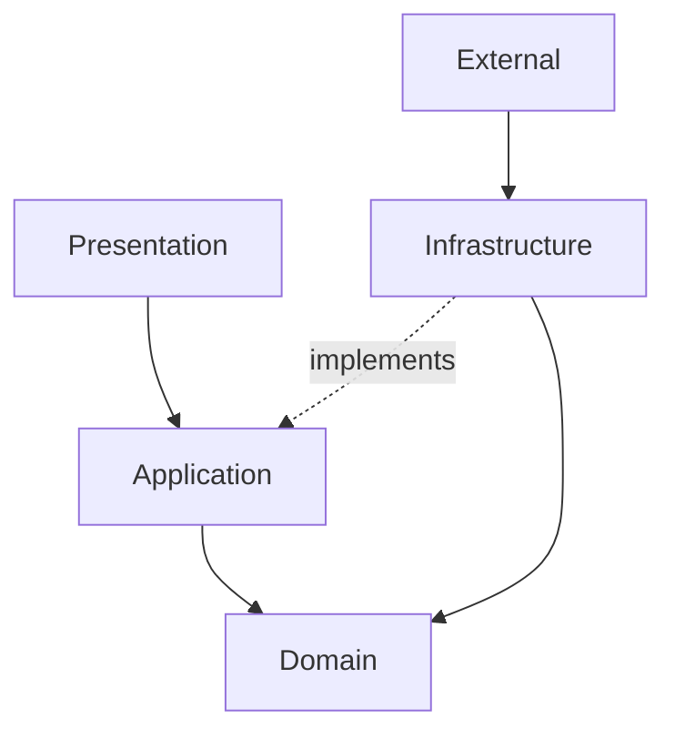

## Document Classification

Type: Engineering Standard

Mission: Mission 14

Status: Approved

Audience:

- Founder
- Software Architect
- Engineering Agents


# IMPLEMENTATION_ARCHITECTURE

> **Project:** Genesis AI  
> **Document Version:** 1.0  
> **Status:** Draft (Mission 14 – Implementation Readiness)  
> **Document Owner:** Software Architect Agent  
> **Reviewed By:** Founder  
> **Approval Status:** Pending  

---

# Table of Contents

1. Purpose
2. Scope
3. Objectives
4. Architecture Goals
5. Architecture Principles
6. Implementation Philosophy
7. High-Level Implementation Architecture
8. Layer Responsibilities
9. Dependency Rules
10. Architectural Constraints

---

# 1. Purpose

This document defines the implementation architecture of Genesis AI.

While previous architecture documents describe **what Genesis AI is**, this document defines **how the approved architecture must be translated into production-quality software** without violating the project's architectural principles.

The Implementation Architecture serves as the engineering blueprint that bridges architectural design and future software implementation.

It establishes clear implementation boundaries, defines module responsibilities, specifies dependency rules, and protects long-term maintainability before a single line of production code is written.

This document is considered the authoritative implementation guide throughout Mission 14.

---

# 2. Scope

This document defines the implementation architecture for the Genesis AI platform.

It covers:

- Implementation layers
- Internal module organization
- Dependency management
- Responsibility allocation
- Interface boundaries
- Package ownership
- Configuration strategy
- Error handling approach
- Logging architecture
- Security foundations
- Testing readiness
- Scalability considerations
- Maintainability guidelines

The following topics are intentionally excluded because they belong to future missions:

- Workflow Execution Engine
- Runtime Scheduling
- Tool Integration Framework
- Knowledge Base
- Multi-Project Execution
- Monitoring Platform
- Distributed Deployment
- Agent Runtime Optimization

Those capabilities will be introduced only after Founder approval during future missions.

---

# 3. Objectives

The Implementation Architecture exists to achieve the following engineering objectives.

## 3.1 Preserve Approved Architecture

Every implementation decision must remain consistent with the approved system architecture, domain models, ADRs, and engineering standards.

No implementation may redefine architecture.

Implementation follows architecture.

Never the opposite.

---

## 3.2 Enable Independent Development

Every implementation module should be independently understandable, testable, maintainable, and replaceable without affecting unrelated components.

This minimizes coupling and supports long-term scalability.

---

## 3.3 Improve Maintainability

Genesis AI is expected to evolve over many years.

Therefore implementation decisions must prioritize maintainability over short-term development speed.

Temporary shortcuts are prohibited.

---

## 3.4 Support Future Growth

Implementation must allow the platform to grow from a single-machine prototype into a production-scale autonomous AI platform without requiring architectural redesign.

Scalability is achieved through architecture—not through later rewrites.

---

## 3.5 Reduce Engineering Risk

A well-defined implementation architecture reduces ambiguity, prevents inconsistent development practices, and enables engineering teams to work confidently within clearly defined boundaries.

---

# 4. Architecture Goals

The implementation architecture is designed to achieve the following long-term engineering goals.

- High cohesion
- Low coupling
- Explicit responsibilities
- Clear dependency direction
- Testability
- Replaceable implementations
- Strong documentation
- Predictable behavior
- Controlled complexity
- Production readiness

Every implementation decision should contribute toward these goals.

---

# 5. Architecture Principles

The following principles are mandatory throughout implementation.

## Architecture Before Implementation

Architecture defines implementation.

Implementation never defines architecture.

---

## Documentation Before Development

Every significant implementation decision must be documented before development begins.

Documentation remains the project's primary source of truth.

---

## Separation of Concerns

Each layer, module, service, and component must have a clearly defined responsibility.

Business logic, infrastructure logic, presentation logic, and orchestration logic must never become mixed.

---

## Single Responsibility Principle

Every module should have one primary reason to change.

Responsibilities should remain focused, explicit, and easy to understand.

---

## Dependency Inversion

Business logic must never depend directly on technical implementation details.

Higher-level modules define contracts.

Lower-level modules provide implementations.

---

## Explicit Boundaries

Every module boundary must be intentionally designed.

Implicit dependencies, hidden coupling, and undocumented interactions are prohibited.

---

## Traceability

Every implementation decision should be traceable back to one or more approved architectural documents.

Examples include:

- SYSTEM_ARCHITECTURE.md
- PROJECT_WORKFLOW.md
- MESSAGE_CONTRACTS.md
- MEMORY_ARCHITECTURE.md
- PROJECT_OBJECT_MODEL.md
- ADR Repository

Traceability simplifies reviews, audits, maintenance, and future architectural evolution.

---

# 6. Implementation Philosophy

Genesis AI follows a Documentation-Driven Implementation Philosophy.

Implementation is treated as the final stage of engineering rather than the beginning.

The expected engineering workflow is:

Requirements

↓

Architecture

↓

Documentation

↓

Review

↓

Approval

↓

Implementation

↓

Testing

↓

Validation

↓

Deployment

Every implementation artifact must originate from an approved architectural decision.

Implementation without documentation is considered incomplete engineering.

---

# 7. High-Level Implementation Architecture

Genesis AI adopts a layered implementation architecture.

Each layer has clearly defined responsibilities and communicates only through approved interfaces.



Dependencies always flow downward.

Reverse dependencies are prohibited.

This architecture protects the Domain Layer from infrastructure concerns while enabling future scalability.

---

# 8. Layer Responsibilities

## 8.1 Presentation Layer

The Presentation Layer represents every entry point into the Genesis AI platform.

Possible implementations include:

- REST APIs
- CLI Interface
- Web Dashboard
- Administrative Console
- Future Desktop Applications

### Responsibilities

- Receive user requests
- Validate incoming data
- Authenticate users
- Forward requests
- Display responses
- Format output

### Non-Responsibilities

The Presentation Layer must never contain:

- Business rules
- Workflow logic
- Agent coordination
- Persistence logic
- Infrastructure concerns

It acts strictly as the communication boundary between users and the application.

---

## 8.2 Application Layer

The Application Layer coordinates the execution of business use cases and orchestrates interactions between the Presentation Layer and the Domain Layer.

It contains application-specific workflows while remaining independent of infrastructure implementation details.

### Responsibilities

- Execute application use cases
- Coordinate AI agent workflows
- Manage task execution
- Handle workflow state transitions
- Enforce application-level policies
- Coordinate transactions
- Invoke domain services
- Publish domain events
- Manage execution flow

### Non-Responsibilities

The Application Layer must never contain:

- Core business rules
- Database implementation
- External API implementation
- User interface logic

The Application Layer orchestrates the system but does not own business knowledge.

---

## 8.3 Domain Layer

The Domain Layer is the heart of Genesis AI.

It contains the business concepts, rules, models, and behaviors that define how the platform operates.

This layer must remain completely independent of frameworks, databases, APIs, or infrastructure technologies.

### Core Domain Components

- Project
- Task
- Workflow
- Agent
- Memory
- Message
- Approval
- Domain Services
- Domain Policies
- Business Rules

### Responsibilities

- Business logic
- Domain validation
- Domain models
- State transitions
- Business policies
- Domain events
- Core decision making

### Non-Responsibilities

The Domain Layer must never know about:

- HTTP
- REST APIs
- Databases
- AI providers
- File systems
- Logging frameworks
- UI frameworks

Business logic must remain technology independent.

---

## 8.4 Infrastructure Layer

The Infrastructure Layer provides technical capabilities required by the system.

Everything inside this layer is replaceable without changing business logic.

### Responsibilities

- Database access
- File storage
- Logging
- Configuration
- AI Provider integration
- External APIs
- Persistence
- Authentication implementation
- Monitoring integration
- Cache implementation

Infrastructure implements contracts defined by higher layers.

---

# 9. Layer Dependency Rules

The following dependency direction is mandatory.



### Allowed Dependencies

- Presentation → Application
- Application → Domain
- Infrastructure → Domain Contracts
- Infrastructure → External Services

### Forbidden Dependencies

- Domain → Application
- Domain → Presentation
- Domain → Infrastructure
- Application → Presentation
- External Services → Domain
- Circular Dependencies

Violation of these rules constitutes an architectural defect.

---

# 10. Module Boundaries

Genesis AI is organized into independent modules.

Each module owns a single business capability.

Proposed implementation modules include:

- Project Management
- Workflow Management
- Agent Management
- Memory Management
- Messaging
- Documentation
- Approval
- Configuration
- Authentication
- Logging
- Infrastructure

Each module communicates only through documented interfaces.

Direct internal access between unrelated modules is prohibited.

---

# 11. Component Communication

Component communication must be explicit, predictable, and traceable.

Communication principles include:

- Interface-first design
- Strong contracts
- Version awareness
- No hidden dependencies
- Explicit ownership
- Immutable message contracts where applicable

Components communicate through the Application Layer rather than directly accessing one another.

This preserves modularity and simplifies future architectural evolution.

---

# 12. Package Organization

Packages should be organized according to business capabilities rather than technical categories.

Example structure:

```text
project/
workflow/
agent/
memory/
messaging/
approval/
documentation/
configuration/
shared/
infrastructure/
```

Each package owns:

- Models
- Services
- Interfaces
- Validators
- Exceptions
- Policies

Package ownership must remain explicit.

---

# 13. Interface Design Rules

Interfaces define contracts between architectural layers.

Implementation classes must depend upon interfaces rather than concrete implementations.

Every interface should:

- Represent one responsibility
- Remain implementation independent
- Be stable
- Be clearly documented
- Support future replacement

Interfaces should be owned by the consuming layer.

---

# 14. Dependency Injection Strategy

Genesis AI follows Dependency Injection principles.

Objects should receive their dependencies instead of creating them.

Benefits include:

- Loose coupling
- Easier testing
- Better maintainability
- Replaceable implementations
- Improved scalability

Manual object creation inside business logic should be avoided.

---

# 15. Shared Components

Shared components provide reusable functionality across modules.

Examples include:

- Common Exceptions
- Shared Value Objects
- Result Objects
- Validators
- Utilities
- Constants
- Base Contracts

Shared components must remain generic.

Business-specific logic must never be placed inside shared modules.

---

# 16. Implementation Constraints

Until Mission 14 is formally completed and approved:

- Production code is prohibited.
- Architecture changes require Founder approval.
- ADR compliance is mandatory.
- Business logic must remain inside the Domain Layer.
- Documentation is the primary source of truth.
- Module boundaries must not be violated.
- Temporary architectural shortcuts are prohibited.

These constraints protect the long-term quality and consistency of the Genesis AI platform.

# 17. Configuration Architecture

Configuration is treated as a first-class architectural component.

All configuration must be centralized, version-controlled where appropriate, and isolated from business logic.

Configuration categories include:

- Application Configuration
- Environment Configuration
- AI Provider Configuration
- Security Configuration
- Database Configuration
- Logging Configuration
- Feature Flags
- Runtime Configuration

### Configuration Principles

- Never hardcode configuration values.
- Environment-specific values must remain external.
- Secrets must never be committed to source control.
- Configuration changes must not require code changes whenever possible.
- Configuration should be validated during application startup.

---

# 18. Error Handling Strategy

Genesis AI adopts a centralized and structured error handling strategy.

Errors should be predictable, traceable, and meaningful.

## Error Categories

- Validation Errors
- Business Rule Violations
- Workflow Errors
- Agent Execution Errors
- Infrastructure Errors
- External Service Errors
- Security Errors
- Unexpected System Errors

Each error should contain:

- Unique Error ID
- Error Type
- Severity Level
- Source Component
- Timestamp
- Human-readable Message
- Technical Context
- Recovery Guidance (where applicable)

Sensitive implementation details must never be exposed outside the system boundary.

---

# 19. Logging Strategy

Logging is an essential engineering capability rather than a debugging tool.

Logs provide visibility into system behavior, support incident investigation, and enable operational monitoring.

## Logging Objectives

- Trace workflow execution
- Track agent communication
- Record system events
- Support debugging
- Enable auditing
- Assist performance analysis

## Events That Should Be Logged

- Application startup
- Application shutdown
- Workflow execution
- Task assignment
- Agent execution
- State transitions
- Validation failures
- Authentication events
- Authorization failures
- External service failures
- Infrastructure failures

Sensitive information such as passwords, API keys, tokens, and confidential user data must never be written to logs.

---

# 20. Security Considerations

Security is integrated into the architecture from the beginning.

Every implementation decision must consider confidentiality, integrity, and availability.

## Security Principles

- Secure by Design
- Least Privilege
- Defense in Depth
- Input Validation
- Output Sanitization
- Authentication
- Authorization
- Secure Secret Management
- Auditability

Security requirements apply equally to every architectural layer.

---

# 21. Testing Readiness

The implementation architecture must support testing at every level of the system.

## Testing Levels

- Unit Testing
- Component Testing
- Integration Testing
- Workflow Testing
- End-to-End Testing
- Regression Testing

Every module should be independently testable.

Business logic should be testable without infrastructure dependencies.

Testing support is considered an architectural requirement rather than an implementation enhancement.

---

# 22. Scalability Considerations

Genesis AI is designed for long-term growth.

The implementation architecture should support increasing complexity without requiring major architectural redesign.

Key scalability characteristics include:

- Modular architecture
- Replaceable implementations
- Independent components
- Clear ownership
- Minimal coupling
- Explicit interfaces
- Extensible workflows

Future capabilities should extend the architecture rather than replace it.

---

# 23. Maintainability Guidelines

Long-term maintainability takes priority over short-term development speed.

Every implementation should aim to:

- Minimize technical debt
- Reduce unnecessary complexity
- Preserve readability
- Follow approved coding standards
- Respect module ownership
- Maintain clear documentation
- Avoid duplication

Maintainability is a continuous engineering responsibility.

---

# 24. Architectural Compliance

Before implementation begins, the following conditions must be satisfied:

- Architecture documentation is complete.
- Domain models are approved.
- Repository structure is finalized.
- Coding standards are approved.
- Development workflow is established.
- ADR compliance is verified.
- Module boundaries are documented.
- Dependency rules are satisfied.
- Implementation readiness has been reviewed.
- Founder approval has been granted.

Implementation must not begin until these requirements have been fulfilled.

---

# 25. Relationship with Other Architecture Documents

This document should be read together with the following documentation:

- SYSTEM_ARCHITECTURE.md
- ENGINEERING_LAYER_ARCHITECTURE.md
- PROJECT_WORKFLOW.md
- AGENT_COMMUNICATION_PROTOCOL.md
- AGENT_MESSAGING_ARCHITECTURE.md
- MESSAGE_CONTRACTS.md
- EXECUTION_BOUNDARIES.md
- MEMORY_ARCHITECTURE.md
- PROJECT_OBJECT_MODEL.md
- TASK_OBJECT_MODEL.md
- AGENT_STATE_MODEL.md
- WORKFLOW_STATE_MODEL.md
- CODING_STANDARDS.md
- DEVELOPMENT_WORKFLOW.md
- ADR Repository

Together, these documents form the complete architectural foundation of Genesis AI.

---

# 26. Conclusion

The Implementation Architecture establishes the engineering foundation required to transform the approved Genesis AI architecture into a production-grade software system.

It defines how implementation must be organized while preserving architectural integrity, governance, maintainability, scalability, and traceability.

This document does not authorize implementation.

Production development may begin only after Mission 14 has been fully completed, reviewed, approved by the Founder, committed to the repository, and pushed to GitHub.

Until that milestone is achieved, this document remains the authoritative implementation guide for all future engineering work.

---

# Revision History

| Version | Date | Description | Author |
|----------|------|-------------|--------|
| 1.0 | Mission 14 | Initial Implementation Architecture | Software Architect Agent |

---

## Related Documents

- IMPLEMENTATION_ARCHITECTURE.md
- REPOSITORY_STRUCTURE.md
- CODING_STANDARDS.md
- DEVELOPMENT_WORKFLOW.md

**End of Document**

